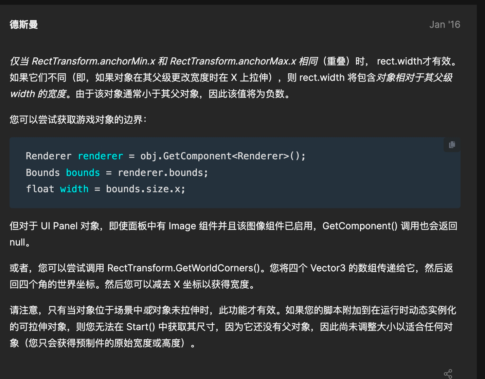

### RectTransform

- 如何获取UI真实宽度
  一般来说，可以通过Rect.width或者SizeDelta.x获得，但是
  
- 关于进度条：Image不能在Filled类型的同时享受Sliced效果
  - 1 在Filled模式下实现Sliced效果（这个是最没有头绪的）
  - 2 在Sliced模式下实现Filled效果（感觉可以用Shader处理？）
  - 3 单方向的简单进度条，可以修改锚点和Pivot后修改长宽
  - https://www.cnblogs.com/ninomiya/p/8134497.html